# Cadastro de Itens

Iniciamos o treinamento referente ao módulo **Cadastro de Itens**, nele veremos vários tipos de cadastros que podem ser realizados.  
O módulo que iremos utilizar nesse treinamento será o **Módulo Estoque**, representado pela imagem abaixo:  

  
*(Imagem 1.0)*  

Nesse módulo, podemos ver várias opções que ele permite realizar, desde cadastros, divisões da seção do produto, grupo ou subgrupo, fichas técnicas, fechamentos e consultas de relatórios.  
Assim que abrimos a tela **Cadastro > Item**, ele mostra uma relação de itens cadastrados nos últimos 15 dias:  

  
*(Imagem 1.1)*  

Caso haja necessidade de manutenção ou alteração de algum campo referente a algum item cadastrado e ele tenha sido feito essas alterações nos últimos 15 dias, ele aparecerá conforme o destaque na imagem acima *(Imagem 1.1)*. Caso o item não apareça nessa relação, há possibilidade de pesquisa, tanto pelo nome do item ou código do item. Segue exemplo do campo conforme imagem abaixo:  

  
*(Imagem 1.2)*  

Campos a serem observados referente ao cadastro de cada item, uma breve explicação do que significa cada campo, conforme imagem a seguir:  

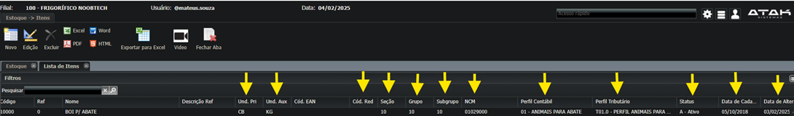  
*(Imagem 1.3)*  

### Campos Importantes

#### Unidade Primária (Und. Pri)
- **Significado**: Unidade de medida principal utilizada para o item.  
- **Importância**: Define a unidade padrão para controle de estoque e vendas, garantindo consistência nas operações.  

#### Unidade Auxiliar (Und. Aux)
- **Significado**: Unidade de medida auxiliar utilizada para o item.  
- **Importância**: Permite a conversão entre diferentes unidades de medida, facilitando a gestão de estoque e vendas em múltiplas unidades.  

#### Código EAN (Cód. EAN)
- **Significado**: Código de barras internacional utilizado para identificar o item.  
- **Importância**: Facilita a identificação e rastreamento do item em sistemas de ponto de venda e logística.  

#### Código Reduzido (Cód. Red)
- **Significado**: Código interno reduzido utilizado para identificar o item.  
- **Importância**: Simplifica a referência ao item em documentos internos e sistemas de gestão.  

#### Seção
- **Significado**: Categoria ou seção à qual o item pertence.  
- **Importância**: Ajuda na organização e classificação dos itens, facilitando a localização e o gerenciamento.  

# Grupo
- **Significado**: Subcategoria ou grupo dentro da seção.  
- **Importância**: Fornece uma classificação mais detalhada dos itens, melhorando a organização e a análise de dados.  

# Subgrupo
- **Significado**: Subdivisão dentro do grupo.  
- **Importância**: Permite uma classificação ainda mais específica, auxiliando na gestão detalhada do estoque.  

# NCM (Nomenclatura Comum do Mercosul)
- **Significado**: Código utilizado para classificar mercadorias no comércio internacional.  
- **Importância**: Essencial para a correta tributação e conformidade com as regulamentações aduaneiras.  

# Perfil Contábil
- **Significado**: Categoria contábil atribuída ao item.  
- **Importância**: Facilita a contabilização correta das transações envolvendo o item, garantindo precisão nos relatórios financeiros.  

# Perfil Tributário
- **Significado**: Categoria tributária atribuída ao item.  
- **Importância**: Assegura a aplicação correta das alíquotas e regras fiscais, evitando problemas com a legislação tributária.  

# Status
- **Significado**: Indica se o item está ativo ou inativo.  
- **Importância**: Permite o controle do ciclo de vida do item, garantindo que apenas itens ativos sejam utilizados em operações.  

# Data de Cadastro
- **Significado**: Data em que o item foi cadastrado no sistema.  
- **Importância**: Fornece um histórico de quando o item foi adicionado, útil para auditorias e controle de mudanças.  

# Data de Alteração
- **Significado**: Data da última alteração feita no cadastro do item.  
- **Importância**: Ajuda a rastrear mudanças e manter um registro atualizado das informações do item.  

---

## Unidade Primária
- **Comercialização**

## Unidade Auxiliar
- **Estoque**

---

## Cadastro de um Novo Item

Agora iremos para a tela cadastrar um novo item, e verificar os campos obrigatórios que será necessário preencher na hora de realizar um novo cadastro:  
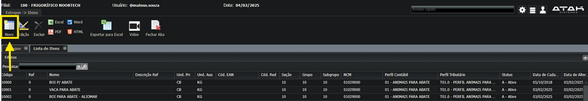  
*(Imagem 1.4)*  

Ao clicar no ícone **Novo**, irá abrir uma tela chamada "Novo Item" e seus respectivos campos a serem preenchidos:  
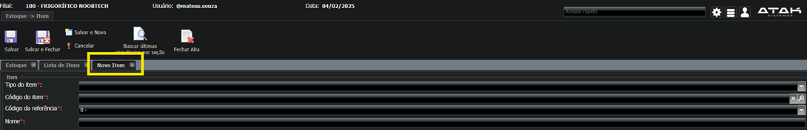  
*(Imagem 1.5)*  

O primeiro campo a ser preenchido é o **Tipo do Item**, essencial para começar a realizar o cadastro, pois ele determina quais campos dali para frente serão obrigatórios:  
  
*(Imagem 1.6)*  

---

### Tipos de Item
- **Matéria-prima (MP)**  
- **Produto acabado (PA)**  
- **Produto revenda (PR)**  
- **Almoxarifado (AL)**  
- **Imobilizado (IM)**  
- **Serviços (SE)**  
- **Fórmula (FM)**  
- **Teste de abate (AT)**  
- **Perfil tributário (PT)**: Itens que terão o mesmo perfil tributário.  
- **Linha de produto (LP)**  
- **Peças compradas (PC)**  
- **Peças fabricadas (PF)**  
- **Peças processadas (PP)**  
- **Material de consumo (MC)**  
- **Outros insumos (OI)**  
- **Vacina (VA)**  
- **Medicamento (ME)**  
- **Ração (RA)**  
- **Todos/Outros (O)**  

---

## Divisão  

  

### Seção de Produto  
  

### Grupo de Produto  
  

### Subgrupo de Produto  
  

---

### Cadastro de um Novo Item:

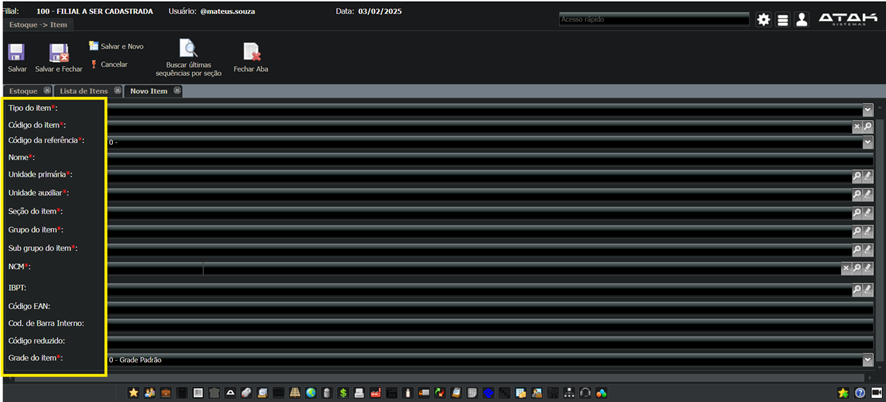
(Imagem 1.0)

# Módulo Estoque
## Cadastro
### Item
#### Novo Cadastro

- **Tipo de item**: Tipo do item é o que vai determinar quais campos obrigatórios serão necessários preencher.  
- **Código do item**: O código do item é o mesmo código da seção, precisa buscar no campo seção.  
- **Buscar últimas sequências por seção**.  
- **Código da referência**: Não fazer alteração.  
- **Nome**: Sempre letra maiúscula, sem acentuação.  
- **Unidade primária**.  
- **Unidade auxiliar**.  
- **Seção do item**.  
- **Grupo do item**.  
- **Subgrupo do item**.  
- **NCM**.  
- **IBPT**: O IBPT, ou Instituto Brasileiro de Planejamento e Tributação, é uma entidade que realiza estudos sobre a carga tributária no Brasil.  
- **Código EAN**.  
- **Código de barra interno**.  
- **Código reduzido**.  
- **Grade do item**: Não fazer alteração.  
- **SALVAR**.  

*(Imagem 1.0)*  

---

## Passo a Passo para Cadastro de um Item

1. Abra o **módulo Estoque** e clique em **Item** que está no campo **Cadastro**, conforme imagem abaixo:  
     
   *(Imagem 0.0)*  

2. Segue abaixo os tipos de cortes que poderão ser realizados no cadastro, tanto da meia carcaça ou dos quartos (TRASEIRO, TRASEIRO CAPOTE, TRASEIRO SERROTE ...):  
     
   *(Imagem 0.1)*  

3. O primeiro passo é informar o **Tipo do Item**. Nesse exemplo, iremos cadastrar o tipo **Matéria Prima**:  
     
   *(Imagem 0.2)*  

4. O segundo passo é informar a **Seção do Item**. É na seção do item que conseguimos a informação para qual código do item será informado:  
     
   *(Imagem 0.3)*  
     
   *(Imagem 0.4)*  

5. Clique em **Buscar últimas sequências por seção** para encontrar o último código do item disponível.  
   *(Imagem 0.4)*  

6. Após preencher todos os campos obrigatórios, a tela de cadastro do item deve estar assim:  
     
   *(Imagem 0.5)*  

7. Após salvar a tela, uma sub-tela será aberta informando que alguns campos (**Formulários**) são necessários para que o item esteja ativo:  
     
   *(Imagem 0.6)*  

# Comercial

- **Unidade de venda**: Refere-se à comissão referente ao item.  
- **Nível de estoque**: Média máxima ou mínima que posso ter em estoque desse item.  
- **Inventário**: Processo de contagem, registro e avaliação dos bens e materiais que uma empresa possui.  
- **Estoque online**: Refere-se ao gerenciamento e monitoramento de inventário em tempo real através de sistema.  
- **Filiais**: Indica se esse item será liberado para todas as filiais ou apenas algumas específicas.  
- **Vendas**: Processo de troca de bens ou serviços por dinheiro. Envolve a identificação de clientes, apresentação de produtos, negociação de preços e fechamento de transações. É essencial para gerar receita e sustentar o negócio.  

  
*(Imagem 0.7)*  

---

## Comercial

Para o formulário **COMERCIAL**, preencha o seguinte campo:

- **Unidade de venda**: A "unidade de venda" refere-se à medida padrão pela qual um produto é vendido. Pode ser uma unidade física, como peça, quilo, litro, metro, etc. Por exemplo, se você vende maçãs, a unidade de venda pode ser o quilo. Se você vende camisetas, a unidade de venda pode ser a peça. Isso ajuda a padronizar as transações e facilita o controle de estoque e a precificação.  

  
*(Imagem 0.8)*  

---

## Contabilidade

Para o formulário **Contábil**, preencha os seguintes campos:  
  
*(Imagem 0.9)*  
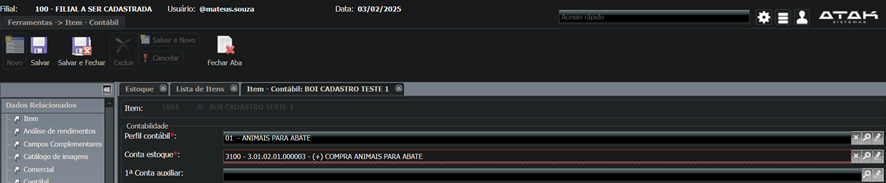  
*(Imagem 1.0)*  

- **Perfil contábil**: Refere-se à categorização de transações financeiras e itens dentro de um sistema contábil. Ele define como as transações serão registradas e tratadas nos livros contábeis da empresa. Cada perfil contábil pode ter regras específicas para a contabilização, como contas de débito e crédito, centros de custo, e outras informações relevantes para a correta classificação e análise financeira.  
- **Conta estoque**: Conta registrada para controlar para qual perfil contábil o item será necessário ser cadastrado.  

---

## Fiscal

Para o formulário **Fiscal**, preencha os seguintes campos:  
  
*(Imagem 1.1)*  
  
*(Imagem 1.2)*  
  
*(Imagem 1.3)*  
  
*(Imagem 1.4)*  

- **Descrição nota fiscal**: Nome do item cadastrado que irá aparecer na emissão de nota fiscal.  
- **NCM**: Conseguimos identificar o NCM através do campo tipo item SPED.  
- **Gênero item SPED**: Seguindo a mesma lógica do NCM para o número do gênero.  
- **Perfil tributário**: Refere-se à categorização de um item, serviço ou empresa para fins de tributação. Define como os impostos serão aplicados e calculados, de acordo com as leis e regulamentações fiscais. Cada perfil tributário pode incluir informações sobre alíquotas de impostos, isenções, regimes especiais e outras regras fiscais específicas.  

---

## Fiscalização do Bloco K

O Bloco K é uma parte da Escrituração Fiscal Digital (EFD-ICMS/IPI) que se concentra no controle da produção e do estoque das empresas. Ele foi introduzido para aumentar a transparência e facilitar o cruzamento de dados fiscais, sendo essencial para a fiscalização tributária.  

  
*(Imagem 1.5)*  

---

### Observação

Quando for realizar o preenchimento dos campos, seguir a seguinte sequência:  
  
*(Imagem 1.6)*  

# PPCP

- **Unidade de reserva de estoque**:  
  Diferença entre a unidade de reserva de estoque primária e a auxiliar está na forma como os itens são medidos e controlados no sistema de gestão de estoque.  
  - **Reserva de Estoque Primária**: É a unidade de medida principal utilizada para controlar e registrar os itens no estoque.  
  - **Reserva de Estoque Auxiliar**: É uma unidade de medida adicional que pode ser utilizada para converter a unidade primária em outra unidade de medida.  

- **Forma de identificação do produto nas entradas de estoque**:  
  Qual seria a forma de entrada desse item no estoque (kg, unidades, litros, etc.).  

- **Forma de identificação do produto nas saídas de estoque**:  
  Qual seria a forma de saída desse item no estoque (kg, unidades, litros, etc.).  

- **OBS**:  
  Classes de movimento que o item sofre decomposição:  
  Itens a serem utilizados para finalização do item (embalagens, "Estreche", etc.) sempre selecionar todos os campos, menos o campo ‘nada’.  
    
  *(Imagem 1.7)*  

- **Ler como separadas ou juntas?**  
  Geralmente para bovinos e suínos.  
    
  *(Imagem 1.8)*  

---

# Aba Filial

Informar qual o tipo de quarto (corte), é onde entra a transformação por tipos de corte de carne.  
  
*(Imagem 2.0)*  

---

## Tipos de Cortes Realizados em um Frigorífico

A imagem apresenta um guia de cortes de carne bovina, vamos analisar cada um deles:  

### Tipos de Cortes

A imagem agrupa os cortes em **quatro categorias principais**:

1. **Quarto Traseiro**  
   Região localizada na parte de trás do boi, conhecida pela maciez e sabor.  
   - **Coxão Bola**: Corte grande e arredondado, com pouca gordura, ideal para assados, bifes e escalopes.  
   - **Alcatra**: Corte nobre e versátil, com sabor intenso e textura macia, perfeito para bifes, churrascos e assados.  

2. **Costela**  
   Região do tórax do boi, com osso e gordura, o que garante sabor e suculência.  
   - **Costela Inteira**: Peça grande e saborosa, com várias camadas de carne e osso, ideal para churrascos e assados.  
   - **Costela Ripa**: Corte mais magro e com menos osso, ideal para churrascos rápidos.  
   - **Costela Janela**: Corte com osso em formato de "janela", com carne macia e saborosa, ideal para grelhar.  
   - **Costela Grossa/Minga**: Corte com mais carne e menos osso, ideal para assados e cozidos.  
   - **Costela Assado de Tira**: Corte argentino, com osso e carne macia e saborosa, ideal para churrascos.  
   - **Ponta de Peito**: Parte final da costela, com bastante gordura e sabor, ideal para churrascos e defumação.  
   - **Peito sem Osso**: Corte magro e saboroso, ideal para cozidos, assados e recheios.  
   - **Brisket**: Corte americano, com gordura e sabor intenso, ideal para defumação.  

3. **Dianteiro sem Peito**  
   Região dianteira do boi, com carne mais dura e saborosa, ideal para cozidos e caldos.  
   - **Filé Agulha**: Corte pequeno e saboroso, com textura macia, ideal para bifes e medalhões.  
   - **Paleta**: Corte grande e saboroso, com osso e nervos, ideal para cozidos, assados e recheios.  

4. **Contrafilé**  
   Corte nobre e saboroso, com uma capa de gordura que garante maciez e sabor.  
   - **Bife Ancho**: Corte argentino, com marmoreio e capa de gordura, ideal para churrascos.  
   - **Bife Chorizo**: Corte lateral do contrafilé, com capa de gordura e sabor intenso, ideal para churrascos.  
   - **Prime Rib**: Corte com osso, com carne macia e saborosa, ideal para assados e churrascos.  
   - **Bife de Tira**: Corte em tiras do contrafilé, com sabor intenso e rápido preparo, ideal para churrascos.  
   - **Filé Simples**: Corte magro e saboroso, ideal para bifes e medalhões.  
   - **Capa de Filé**: Parte superior do contrafilé, com mais gordura e sabor, ideal para churrascos.  
   - **Bananinha**: Corte pequeno e saboroso, com textura macia, ideal para petiscos e acompanhamentos.  

5. **Traseiro Capote**  
   Região localizada na parte de trás do boi, com carne magra e saborosa.  
   - **Coxão Mole**: Corte grande e magro, ideal para assados, bifes e escalopes.  
   - **Patinho**: Corte pequeno e magro, ideal para bifes, escalopes e recheios.  
   - **Lagarto**: Corte magro e saboroso, ideal para assados, cozidos e recheios.  
   - **Picanha**: Corte nobre e saboroso, com uma capa de gordura que garante sabor e suculência, ideal para churrascos.  

6. **Traseiro Capote sem Bola**  
   Região do traseiro do boi, sem o coxão bola, com carne magra e saborosa.  
   - **Coxão Mole**: *(Já descrito anteriormente)*  
   - **Patinho**: *(Já descrito anteriormente)*  
   - **Lagarto**: *(Já descrito anteriormente)*  
   - **Picanha**: *(Já descrito anteriormente)*  

7. **Traseiro Serrote**  
   Região do traseiro do boi, com cortes menores e mais específicos.  
   - **Coxão Duro**: Corte grande e magro, ideal para cozidos, assados e caldos.  
   - **Ponta da Alcatra**: Corte saboroso e macio, ideal para churrascos e assados.  
   - **Maminha**: Corte pequeno e saboroso, com textura macia, ideal para churrascos e grelhados.  

# Suprimentos

"Suprimentos" refere-se à gestão e controle de todos os materiais, insumos e produtos necessários para as operações diárias da empresa. Isso inclui a aquisição, armazenamento e distribuição de itens como alimentos para os animais, medicamentos, embalagens, equipamentos de manutenção e produtos químicos utilizados no processamento da carne.

- **Definição**: Controle e gerenciamento de materiais e insumos necessários para as operações do frigorífico.  
- **Itens Incluídos**:  
  - Alimentos e rações  
  - Medicamentos e vacinas  
  - Embalagens e materiais de armazenamento  
  - Equipamentos e ferramentas de manutenção  
  - Produtos químicos e sanitizantes  
- **Importância**:  
  - **Eficiência Operacional**: Garante que todos os materiais necessários estejam disponíveis quando necessário.  
  - **Qualidade do Produto**: Assegura que os insumos e materiais utilizados são de alta qualidade.  
  - **Conformidade**: Mantém a empresa em conformidade com as regulamentações sanitárias e de segurança.  

---

## Campos Obrigatórios para Preenchimento

  
*(Imagem 2.1)*  

- **Unidade de Compra**:  
  - **Definição**: A medida padrão utilizada para adquirir itens de fornecedores.  
  - **Exemplo**: Caixas, paletes, tambores.  
- **Unidade de Venda**:  
  - **Definição**: A medida padrão utilizada para vender produtos aos clientes.  
  - **Exemplo**: Unidades, quilos, litros.  
- **Importância**:  
  - **Controle de Estoque**: Facilita a conversão e gestão precisa dos produtos.  
  - **Flexibilidade**: Atende às necessidades de fornecedores e clientes de maneira eficiente.  

---

## Subgrupo de Produto  

- **MI**: Mercado Interno  
- **ME**: Mercado Externo  

  

---

# Cadastro de Miúdos  

Neste exemplo, iremos cadastrar o item **RABO**:  

  

1. **Módulo Estoque**  
2. **Cadastro**  
3. **Item**  
4. **Novo**  

  
  
  

---

## Comercial

  

---

## Contabilidade

  

---

## Fiscal

  

---

## PPCP

  
  

---

## Suprimentos

  

---

## Embalagem

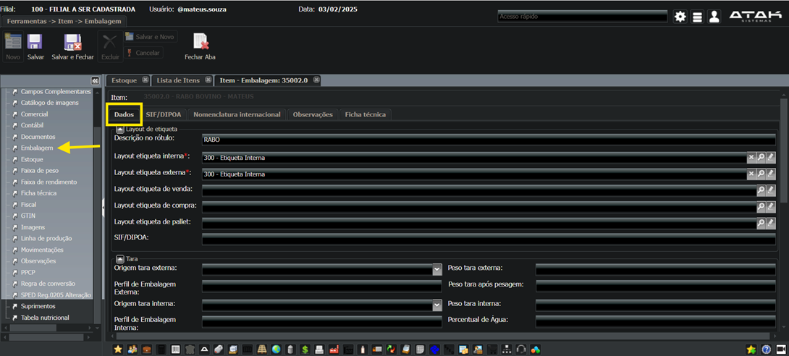  
  
  

---

# Cadastro de Item (Almoxarifado)

- **Caneta Esferográfica Preta**  
- **Papel Toalha**  
- **Faca para Abate**  

# Regra de Conversão

Nada mais é que a troca da forma de entrada ou saída do item (NF). Caso o fornecedor, que eu sempre compro, venda apenas por **fardo**, mas um novo cliente compre por **unidade**, é necessário ir até o cadastro do item, no campo **regra de conversão**, e fazer um novo cadastro para que o sistema entenda que aquela forma de entrada está correta.

  
  
  
  

---

# Cadastro de Item Imobilizado

Itens imobilizados são ativos tangíveis que uma empresa possui e utiliza em suas operações por um período prolongado. Eles não são destinados à venda no curso normal dos negócios.  

## Exemplos Comuns de Itens Imobilizados:
- **Veículos**: Carros, caminhões e outros veículos utilizados para transporte e logística.  
- **Ferramentas**: Ferramentas manuais e elétricas utilizadas na produção ou manutenção.  
- **Equipamentos de Informática**: Computadores, servidores, impressoras e outros dispositivos de TI.  

Esses itens são registrados no balanço patrimonial da empresa como **ativos imobilizados** e são depreciados ao longo do tempo, refletindo seu desgaste e obsolescência.

  
  
  
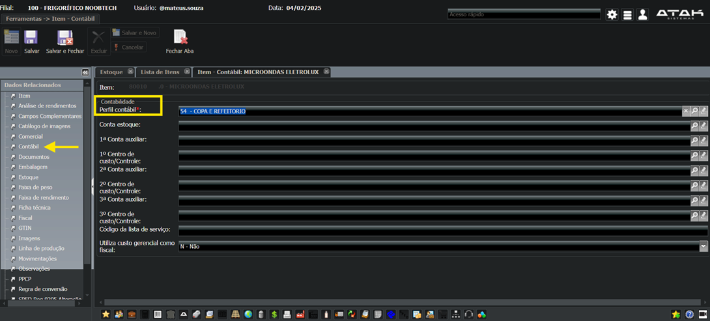  
  
  
  

---

# Cadastro de Terceiros (Serviços)

  
  
  
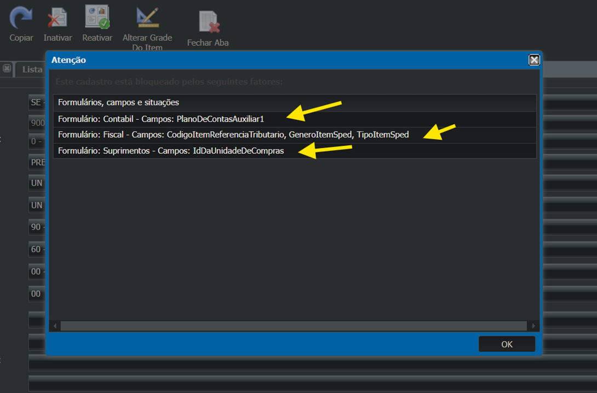  
  
  
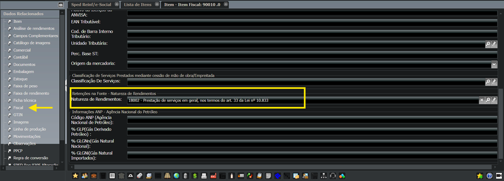  

---

# Cadastro de Serviço

  
  
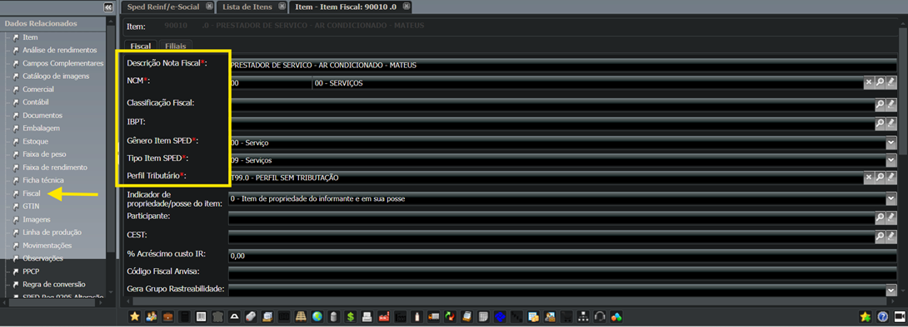  
  

# Precificação 
## (Módulo Comercial)

  

### Exemplo:
  
  

---

## Cadastro de Lista de Preço:

  
  
  
  
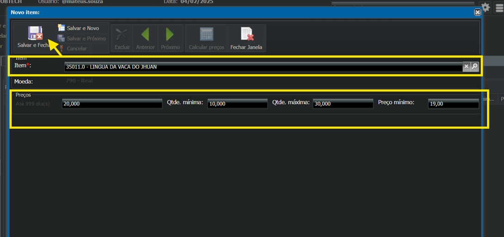  
  
  
  
  
  
  
  

### Observação: 
Caso, após salvar, verifique se será necessário autorizar aprovações para os cadastros do tipo cliente.  
  

---

# SISATAK

  
  
  
  
  
  
  
  
  

---

# Atualização da Condição da Forma de Pagamento (Digitada)

  

  
  
  
  
  
  
  

---

# Precificação Relacionada  

  
  
  
  
  

---

# Tabela de Imposto  
## Cadastro de Escrita Fiscal  

  
  

### PIS (Programa de Integração Social)  
O PIS é um imposto federal que incide sobre a receita bruta das empresas e tem como objetivo financiar programas de integração social, como a seguridade social e programas de formação do patrimônio do servidor público.  
- **Alíquota do PIS**:  
  - 1,65% para empresas que adotam o regime de Lucro Real.  
  - 0,65% para empresas que adotam o regime de Lucro Presumido.  

### COFINS (Contribuição para o Financiamento da Seguridade Social)  
O COFINS também é um imposto federal que incide sobre a receita bruta das empresas e tem como objetivo financiar a seguridade social.  
- **Alíquota do COFINS**:  
  - 7,6% para empresas que adotam o regime de Lucro Real.  
  - 3% para empresas que adotam o regime de Lucro Presumido.  

### ICMS (Imposto sobre Circulação de Mercadorias e Serviços)  
O ICMS é um imposto estadual que incide sobre a circulação de mercadorias e a prestação de serviços de transporte e comunicação, tanto no estado de origem quanto no estado de destino.  
- **Alíquota do ICMS**: Varia de estado para estado e pode ser diferente para diferentes tipos de produtos e serviços.  

### ICMST (Imposto sobre Comunicações e Serviços de Telecomunicações)  
O ICMST é um tributo estadual que incide sobre a prestação de serviços de telecomunicações, como telefonia fixa e móvel, internet e outros serviços de comunicação.  
- **Alíquota do ICMST**: Varia de estado para estado.  

### IPI (Imposto sobre Produtos Industrializados)  
O IPI é um imposto federal que incide sobre a industrialização de produtos, ou seja, sobre a transformação de matérias-primas em produtos acabados.  
- **Alíquota do IPI**: Varia conforme o tipo de produto e pode ser diferente para produtos importados e produtos nacionais.  

---

## Outros Tributos e Contribuições

### SENAR (Serviço Nacional de Aprendizagem Rural)  
O SENAR é um órgão do governo brasileiro responsável pela formação profissional e capacitação de trabalhadores rurais. Ele oferece cursos técnicos e de especialização em diversas áreas do setor agropecuário, como agricultura, agroindústria, zootecnia, entre outros.  

### FUNRURAL (Fundo de Assistência ao Trabalhador Rural)  
O FUNRURAL é uma contribuição previdenciária destinada a financiar a seguridade social dos trabalhadores rurais.  
- **Base de Cálculo**: Receita bruta da comercialização da produção.  

### GILRAT (Contribuição do Grau de Incidência de Incapacidade Laborativa Decorrente dos Riscos do Ambiente de Trabalho)  
O GILRAT é uma contribuição previdenciária que financia a aposentadoria especial e outros benefícios relacionados a acidentes de trabalho e doenças ocupacionais.  
- **Alíquotas**: Variam de acordo com o grau de risco das atividades desenvolvidas pela empresa.  

# Criar uma Tabela de Tributação  
## (PIS/COFINS)  

  
  
  

**Observação:**  
Seção inicial e seção final sempre será **(95 – PERFIL TRIBUTAÇÃO)**  

  
  
  
  

---

# Criar uma Tabela de Tributação  
## (ICMS/ICMST)  

  
  
  
  
  
  
  
  
  
  
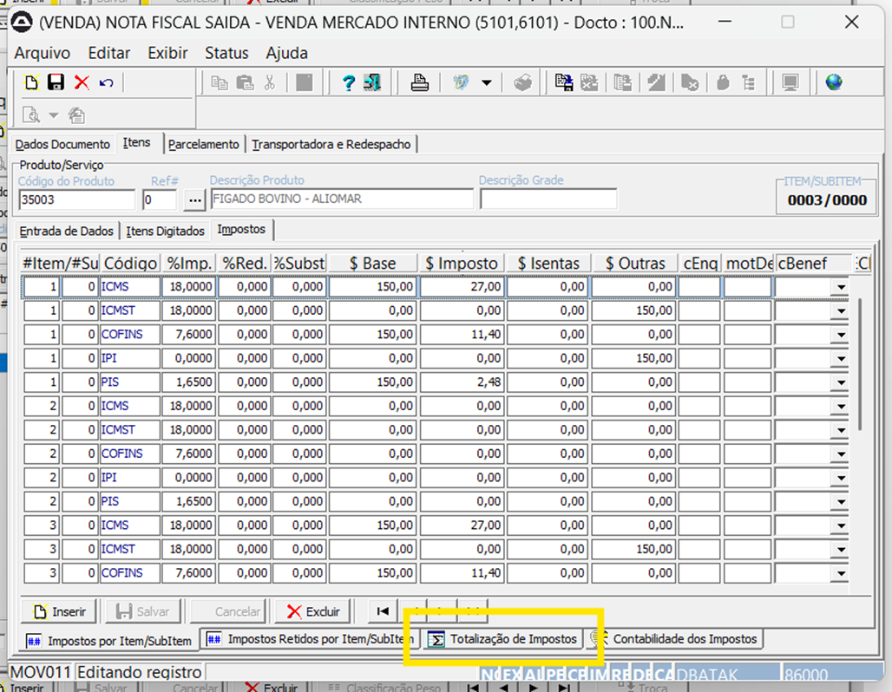  
  
  
  
  
  
  

---

# Criação de Perfil Tributário  

  
  
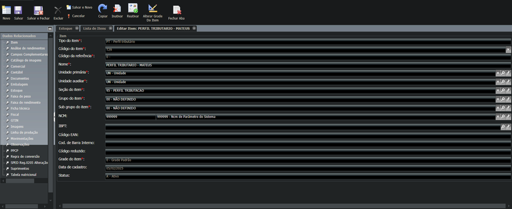  
  
  
  
  

---

# Perfil Cadastro Geral Tributário  

  